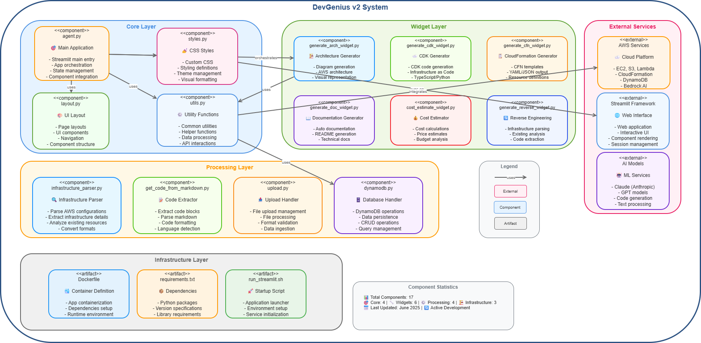
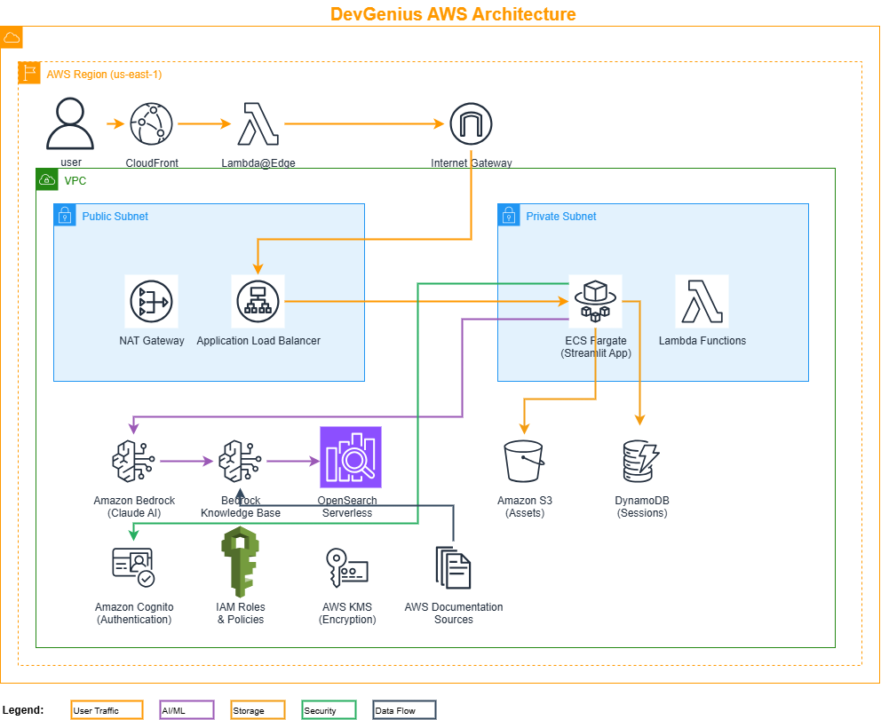

# DevGenius v2 - AWS Solution Generator

DevGenius v2 is an AI-powered application that transforms project ideas into complete, ready-to-deploy AWS solutions. It leverages Amazon Bedrock and Claude AI models to provide architecture diagrams, cost estimates, infrastructure as code, and comprehensive technical documentation.


> **Note:** This project is based on the [AWS Sample DevGenius Solution Builder](https://github.com/aws-samples/sample-devgenius-aws-solution-builder.git) but has been significantly enhanced with new features, improved architecture, and additional capabilities in version 2.

## What's New in v2

DevGenius v2 introduces a modular, layered architecture with enhanced capabilities:

- **Modular Component Architecture**: Organized into Core, Widget, Processing, and Infrastructure layers
- **Enhanced Reverse Engineering**: Improved infrastructure parsing and analysis from existing architectures
- **Better Code Extraction**: Advanced markdown parsing and code block extraction
- **Improved UI/UX**: Enhanced styling and layout components
- **Optimized Processing**: Better separation of concerns across layers

## Architecture

### System Components



The system is organized into four distinct layers:

- **Core Layer**: Main application orchestration, UI layout, styling, and utility functions
- **Widget Layer**: Specialized components for each major feature (architecture generation, CDK/CFN generation, cost estimation, documentation, reverse engineering)
- **Processing Layer**: Backend processing for infrastructure parsing, code extraction, file uploads, and database operations
- **Infrastructure Layer**: Container definitions, dependencies, and deployment scripts

### AWS Deployment Architecture



The application is deployed on AWS with a comprehensive cloud-native architecture including:
- CloudFront distribution with Lambda@Edge authentication
- ECS Fargate for containerized application hosting
- Application Load Balancer for traffic management
- Amazon Bedrock with Claude AI and Knowledge Base
- OpenSearch Serverless for vector embeddings
- S3 for asset storage and DynamoDB for session management
- Cognito for user authentication

## Key Features

### 🏗️ **Conversational Solution Architecture Building**
Design AWS solution architectures through natural conversation. Create architecture diagrams (draw.io format), refine them interactively, and generate end-to-end automation code with CDK or CloudFormation templates.

### 🖼️ **Build from Whiteboard Drawings**
Upload architecture images (whiteboard drawings, existing diagrams) and DevGenius will analyze, explain, and help you refine the design before generating deployment code.

### 📊 **Cost Estimation**
Get detailed cost breakdowns for all proposed AWS services to understand the financial implications of your architecture.

### 📝 **Technical Documentation**
Generate comprehensive documentation for your solutions, including architecture decisions, service configurations, and deployment instructions.

### 🔄 **Reverse Engineering**
Analyze existing infrastructure code (CloudFormation, Terraform) and generate visual diagrams and documentation.

### 🚀 **Infrastructure as Code**
Generate both AWS CDK (TypeScript/Python) and CloudFormation (YAML) templates for deploying your solutions.

## Prerequisites

- AWS Account with appropriate permissions
- AWS CLI configured with credentials
- Python 3.12 or later
- Docker (for container builds and local development)
- Access to Amazon Bedrock models (Claude-3-7-Sonnet/Claude-3-5-Sonnet)

## Installation and Setup

### Local Development

1. Clone the repository:

   ```bash
   git clone https://github.com/jrquinte/devgenius-v2.git
   cd devgenius-v2
   ```

2. Create a virtual environment and install dependencies:

   ```bash
   python -m venv venv
   source venv/bin/activate  # On Windows: venv\Scripts\activate
   pip install -r requirements.txt
   ```

3. Set up the required environment variables in `.env` file:

   ```bash
   AWS_REGION=us-west-2
   BEDROCK_AGENT_ID=<YOUR_BEDROCK_AGENT_ID>
   BEDROCK_AGENT_ALIAS_ID=<YOUR_BEDROCK_AGENT_ALIAS_ID>
   S3_BUCKET_NAME=<YOUR_S3_BUCKET_NAME>
   CONVERSATION_TABLE_NAME=<YOUR_CONVERSATION_TABLE_NAME>
   FEEDBACK_TABLE_NAME=<YOUR_FEEDBACK_TABLE_NAME>
   SESSION_TABLE_NAME=<YOUR_SESSION_TABLE_NAME>
   ```

4. Run the application:

   ```bash
   streamlit run agent.py
   ```

   The application will be available at `http://localhost:8501`

### Docker Deployment

Build and run using Docker:

```bash
docker build -t devgenius-v2 .

docker run -p 8501:8501 \
  -e AWS_REGION="us-west-2" \
  -e BEDROCK_AGENT_ID="<YOUR_BEDROCK_AGENT_ID>" \
  -e BEDROCK_AGENT_ALIAS_ID="<YOUR_BEDROCK_AGENT_ALIAS_ID>" \
  -e S3_BUCKET_NAME="<YOUR_S3_BUCKET_NAME>" \
  -e CONVERSATION_TABLE_NAME="<YOUR_CONVERSATION_TABLE_NAME>" \
  -e FEEDBACK_TABLE_NAME="<YOUR_FEEDBACK_TABLE_NAME>" \
  -e SESSION_TABLE_NAME="<YOUR_SESSION_TABLE_NAME>" \
  devgenius-v2
```

## AWS Infrastructure Deployment

DevGenius v2 includes a CDK stack that deploys all required AWS infrastructure:

### Prerequisites for CDK Deployment

1. Install the CDK toolkit:

   ```bash
   npm install -g aws-cdk
   ```

2. From the root of the repository, install dependencies:

   ```bash
   npm install
   ```

### Deploying to AWS

1. Bootstrap your AWS account (first time only):

   ```bash
   cdk bootstrap
   ```

2. Deploy the complete stack:

   ```bash
   cdk deploy --all --context stackName=devgenius-v2
   ```

   This will provision all necessary AWS resources including:
   - VPC with public and private subnets
   - ECS Fargate service running the Streamlit container
   - Application Load Balancer for traffic distribution
   - CloudFront distribution with Lambda@Edge for authentication
   - Amazon Cognito user pool and identity pool
   - DynamoDB tables for conversation tracking and session management
   - S3 bucket for storing generated assets (diagrams, code, documentation)
   - Amazon Bedrock Agent with Knowledge Base
   - OpenSearch Serverless collection for vector embeddings
   - IAM roles and policies with least privilege access
   - Security groups and network ACLs

3. After deployment completes, CDK will output the application URL (StreamlitUrl)

### Destroying the Infrastructure

When you no longer need the infrastructure, you can tear it down:

```bash
cdk destroy --all --context stackName=devgenius-v2
```

**⚠️ Warning:** This action is irreversible and will delete all AWS resources created by the stack, including:
- All stored conversations and session data in DynamoDB
- Generated assets in S3
- User accounts in Cognito
- Vector embeddings in OpenSearch

You'll be prompted to confirm before the deletion proceeds.

## Project Structure

```
devgenius-v2/
│
├── agent.py                        # Main application entry point (Core Layer)
├── layout.py                       # UI layout and component structure
├── styles.py                       # CSS styling and theme management
├── utils.py                        # Common utility functions and helpers
│
├── Widget Layer (Feature Components)
│   ├── generate_arch_widget.py     # Architecture diagram generation
│   ├── generate_cdk_widget.py      # AWS CDK code generation
│   ├── generate_cfn_widget.py      # CloudFormation template generation
│   ├── generate_doc_widget.py      # Technical documentation generation
│   ├── cost_estimate_widget.py     # AWS cost estimation and analysis
│   └── generate_reverse_widget.py  # Reverse engineering from existing IaC
│
├── Processing Layer (Backend Logic)
│   ├── infrastructure_parser.py    # Parse and analyze infrastructure code
│   ├── get_code_from_markdown.py   # Extract code blocks from markdown
│   ├── upload.py                   # File upload handling and processing
│   └── dynamodb.py                 # DynamoDB operations and data persistence
│
├── Infrastructure Layer
│   ├── Dockerfile                  # Container definition
│   ├── requirements.txt            # Python dependencies
│   ├── run_streamlit.sh           # Application startup script
│   └── .env                       # Environment variables (not in git)
│
├── images/                         # Application assets and diagrams
├── venv/                          # Python virtual environment
└── README.md                       # This file
```

## Usage Guide

### Authentication

1. Access the application URL
2. Sign up for a new account or sign in with existing credentials
3. Accept the terms and conditions

### Building a New Solution

1. Navigate to the "Build a solution" tab
2. Select a topic or describe your requirements
3. Answer the discovery questions about your needs
4. Review the generated solution architecture
5. Generate additional assets:
   - **Cost Estimates**: Detailed pricing breakdown
   - **Architecture Diagram**: Visual draw.io representation
   - **CDK Code**: Infrastructure as Code (TypeScript/Python)
   - **CloudFormation**: YAML templates for deployment
   - **Documentation**: Comprehensive technical documentation

### Analyzing Existing Architecture

1. Navigate to the "Modify your existing architecture" tab
2. Upload an architecture diagram (PNG/JPG) or infrastructure code
3. Review the AI-generated analysis and insights
4. Use the interactive widgets to refine and improve the architecture
5. Generate updated code and documentation

### Reverse Engineering Infrastructure

1. Upload CloudFormation, CDK, or Terraform code
2. DevGenius will parse the infrastructure and extract components
3. Generate visual diagrams from the code
4. Export to various formats (draw.io, documentation, cost estimates)

## Key Components

### Core Layer

- **agent.py**: Main Streamlit application orchestrating all components
- **layout.py**: UI component structure and page layouts
- **styles.py**: CSS theming, styling, and visual formatting
- **utils.py**: Shared utility functions for API interactions and data processing

### Widget Layer

Each widget is a self-contained module responsible for a specific feature:

- Architecture generation (draw.io diagrams)
- CDK code generation (TypeScript/Python)
- CloudFormation template creation (YAML)
- Technical documentation writing
- AWS cost estimation and analysis
- Reverse engineering from existing infrastructure

### Processing Layer

Backend components handling data operations:

- **infrastructure_parser.py**: Parses CloudFormation, CDK, and Terraform
- **get_code_from_markdown.py**: Extracts and formats code blocks
- **upload.py**: Manages file uploads and validation
- **dynamodb.py**: Handles conversation history and session state

### AI Engine

#### Amazon Bedrock Agent and Knowledge Base

DevGenius v2 uses Amazon Bedrock Agents with a custom Knowledge Base containing comprehensive AWS documentation, whitepapers, and blog posts. The agent is configured with specialized prompts to generate AWS solutions following best practices and the AWS Well-Architected Framework.

**Knowledge Base Sources Include:**
- AWS Well-Architected Framework documentation
- AWS Well-Architected Analytics Lens
- AWS Whitepapers on data streaming and analytics architectures
- AWS documentation on data lakes, serverless, and containers
- AWS Architecture Blog posts and case studies
- AWS service announcements and feature updates
- AWS best practices guides

#### Vector Search with OpenSearch Serverless

Architecture information and AWS documentation are stored as vector embeddings in Amazon OpenSearch Serverless, enabling:
- Semantic search across AWS architectural patterns
- Retrieval of relevant documentation and best practices
- Context-aware solution generation
- Similar architecture pattern matching

#### Infrastructure as Code Generation

The application generates production-ready Infrastructure as Code in multiple formats:
- **AWS CDK**: TypeScript and Python templates with proper resource configurations
- **CloudFormation**: YAML templates with nested stacks support
- **Best Practices**: All generated code follows AWS security and operational best practices
- **Modular Design**: Generated code is organized for maintainability and reusability

## Security Features

- **Authentication**: Amazon Cognito user management
- **Network Security**: VPC with security groups for isolation
- **Encryption**: S3 and DynamoDB encryption at rest
- **Access Control**: IAM roles with least privilege permissions
- **Request Validation**: Lambda@Edge for CloudFront

## Contributing

This is an educational project. Contributions, issues, and feature requests are welcome!

## License

**Educational Use License**

This project is for educational purposes. Feel free to use and modify as needed.

This project is based on the AWS Sample DevGenius Solution Builder (https://github.com/aws-samples/sample-devgenius-aws-solution-builder.git) with significant modifications and enhancements in version 2.

## Acknowledgments

- Original AWS Sample by Amazon Web Services
- Amazon Bedrock and Claude AI for powering the solution generation
- AWS architecture best practices and documentation

## Contact

- **Repository**: https://github.com/jrquinte/devgenius-v2
- **Original AWS Sample**: https://github.com/aws-samples/sample-devgenius-aws-solution-builder

---

**DevGenius v2** - Transforming ideas into AWS solutions with AI 🚀